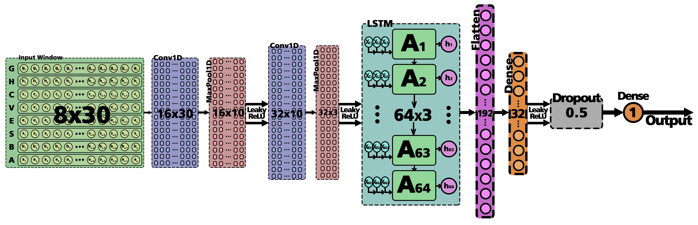
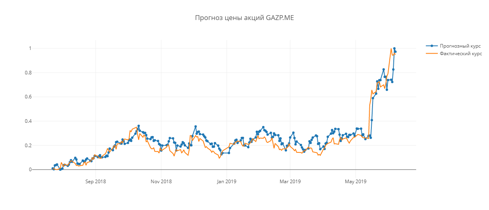

# NeuralStockPredictor
Stock Price Prediction using Convolutional and Recurrent Neural Networks on Keras (Research)

**Research on Google Colab:**
- Russian Language 
- Bad English Translation 

**Description (bad English translation)**
The identification of patterns in the courses of instruments of financial markets allows you to build a model to predict their future movement. To make successful trading decisions, you need to use various methods and tools for analyzing time series.

First, the stock price data of foreign companies (**Tesla, Google, Amazon, Facebook**) and Russian (**Gazprom, Sberbank, Rosneft, VTB**) were obtained. They contain observations on variables such as open, close, maximum and minimum, as well as trading volumes.

The opening price itself is the previous closing price, however, because the stock market closes at the end of the trading session, when opening, due to insufficient demand for supply (or vice versa), a gap between prices arises, called a gap. He, in the future, was used by the neural network instead of the opening price.

The data of the maximum and minimum prices of the day were also replaced by their difference. For the most part, the basic information they give is how much the price changed in both directions during the formation of the candle.

4 more were added to the existing variables, such as **volatility**, which helps the neural network see periods of strong price fluctuations; **stochastic oscillator coefficient**, showing overbought and oversold zones of the instrument; **the difference of two exponential moving averages**, showing local trends; as well as the **autocorrelation coefficient**, which helps to find hidden relationships between the values of one time series at a given shift.

The neural network architecture was a hybrid convolutional and recurrent, which not only reduces the dimensionality of the input data well, while preserving its “nature”, but also fixes their temporal order.

At the beginning, the input data array goes to the “Convolution” convolution layers and the “MaxPooling” union, which reduce its dimension. Then comes the “LSTM” recurrence layer, which allows you to store data in your memory for several iterations. Next, the Flatten anti-aliasing layer converts a two-dimensional data array into a one-dimensional one, after which the fully-connected “Dense” layer transfers data to the “Dropout” layer, which, by excluding a part of the data, protects the network from retraining. Further, after linear activation, we obtain forecast values at the output.

After training the neural network, its accuracy was about **60%**, which indicates a very good forecasting quality.

In addition, a backtesting was carried out, which was an imitation of real trading on historical data, taking into account all commissions.

